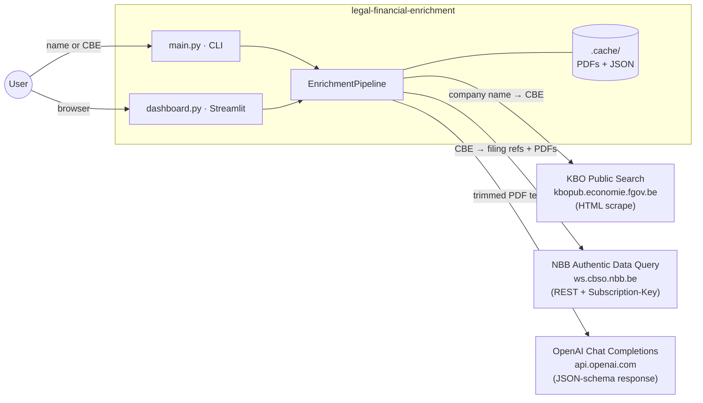
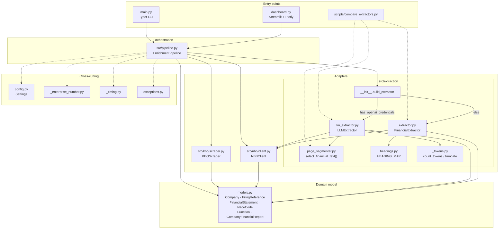
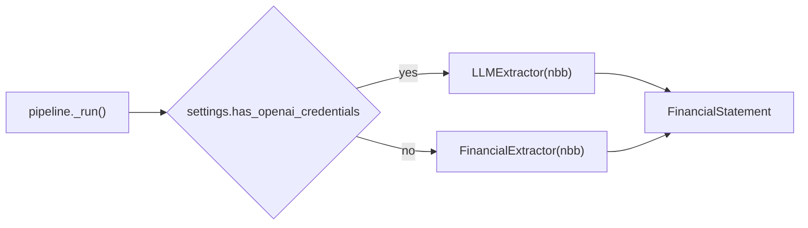
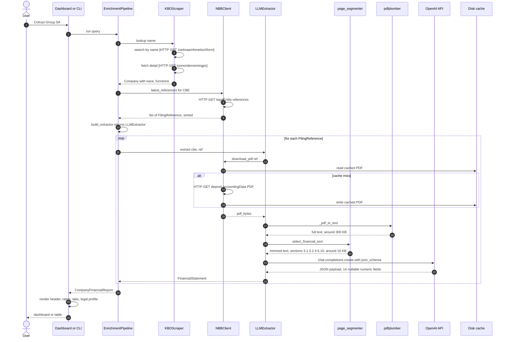
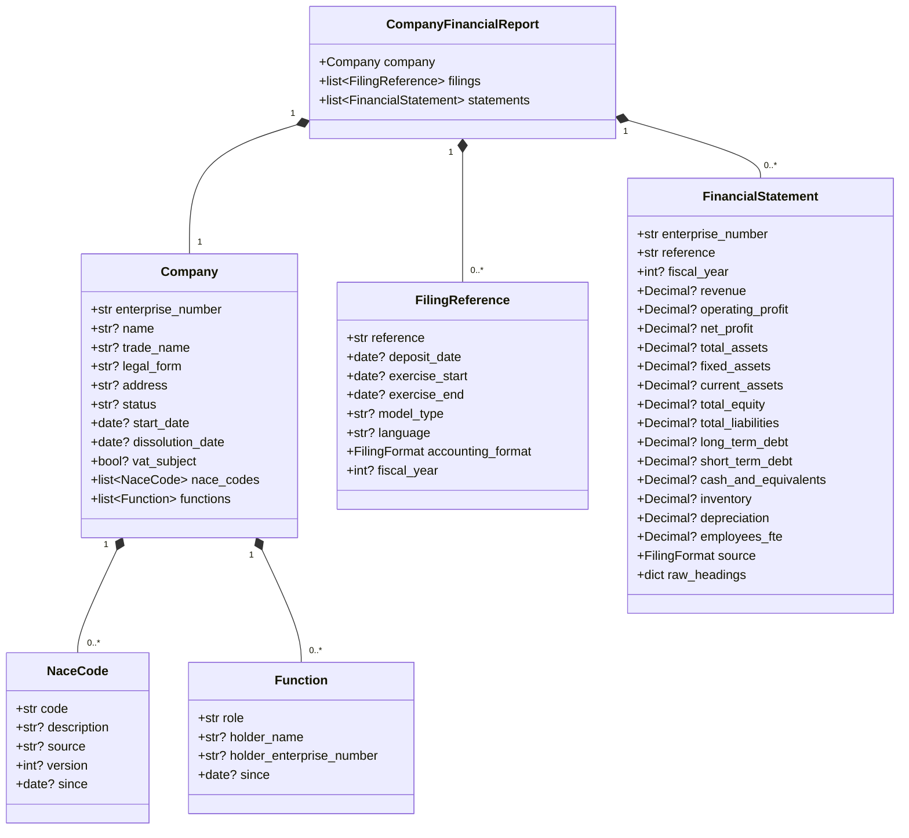

# Architecture

A single-document tour of the project, from the outside boundary in
toward the data model. Read top-to-bottom for a complete picture, or
jump to a section using the table of contents.

All Mermaid blocks render in VS Code's Markdown preview (built-in), in
GitHub, and via the `@mermaid-js/mermaid-cli` if you ever want to
export to SVG or PNG.

## Contents

1. [What this project does](#1-what-this-project-does)
2. [Layered overview](#2-layered-overview)
3. [System context — what's inside vs. outside the boundary](#3-system-context)
4. [Component diagram — every module and edge](#4-component-diagram)
5. [Sequence diagram — runtime flow of a single lookup](#5-sequence-diagram--runtime-flow-of-a-single-lookup)
6. [Data model — the Pydantic types](#6-data-model)
7. [Design notes — read before refactoring](#7-design-notes--read-before-refactoring)

---

## 1. What this project does

Given a Belgian company name or 10-digit enterprise number (CBE), the
project returns a structured `CompanyFinancialReport` containing:

- Legal identification from KBO (Banque-Carrefour des Entreprises): trade
  name, legal form, status, registered address, dissolution date.
- Legal profile: NACE activity codes (per source and Nacebel version),
  directors and officers, VAT-subject status.
- The N most recent annual filings from the National Bank of Belgium's
  Central Balance Sheet Office (NBB CBSO), with extracted financial
  statements: revenue, profit, balance sheet line items, inventory,
  depreciation, employee FTE.

There are two entry points (a Typer CLI and a Streamlit dashboard) and
one shared orchestration class (`EnrichmentPipeline`) that all real
work flows through.

---

## 2. Layered overview

The five horizontal slices of the codebase. Top-down for control flow;
bottom-up to see what every layer depends on.

```
┌─────────────────────────────────────────────────────────────────────┐
│  Entry points                                                        │
│  ─ main.py (Typer CLI)                                               │
│  ─ dashboard.py (Streamlit)                                          │
│  ─ scripts/compare_extractors.py (regex vs LLM benchmark)            │
├─────────────────────────────────────────────────────────────────────┤
│  Orchestration                                                       │
│  ─ src/pipeline.py            EnrichmentPipeline.run(query)          │
├─────────────────────────────────────────────────────────────────────┤
│  Adapters (one per external source)                                  │
│  ─ src/kbo/scraper.py         KBO public search (HTML scrape)        │
│  ─ src/nbb/client.py          NBB CBSO Authentic Data Query API      │
│  ─ src/extraction/            LLM + regex financial extractors       │
├─────────────────────────────────────────────────────────────────────┤
│  Domain model                                                        │
│  ─ src/models.py              Pydantic: Company / FilingReference /  │
│                               FinancialStatement / NaceCode /        │
│                               Function / CompanyFinancialReport      │
├─────────────────────────────────────────────────────────────────────┤
│  Cross-cutting                                                       │
│  ─ src/config.py              env-driven Settings                    │
│  ─ src/_enterprise_number.py  CBE normalisation                      │
│  ─ src/_timing.py             timed() context manager                │
│  ─ src/exceptions.py          typed error hierarchy                  │
└─────────────────────────────────────────────────────────────────────┘
```

### Why these boundaries

- **Entry vs orchestration.** The CLI and the dashboard both call
  `EnrichmentPipeline.run`. Neither knows anything about KBO, NBB or
  OpenAI — they only know about the domain model. This is what lets
  the same pipeline be re-exposed later as a FastAPI service without
  changing anything below the entry layer.
- **Orchestration vs adapters.** The pipeline never touches HTTP, HTML
  or PDF bytes directly. Each adapter owns exactly one external
  concern. When an external source goes down, the failure surfaces as
  a typed exception (`CompanyNotFoundError`, `NBBClientError`,
  `FinancialExtractionError`) — the pipeline catches what it can recover
  from (e.g. a single filing failing to extract) and re-raises the rest.
- **Adapters vs domain.** Every adapter returns Pydantic models, never
  dicts. The pipeline composes those into a `CompanyFinancialReport`
  and hands it back up. Renderers (CLI, dashboard) consume models
  directly — no dict-walking, no key errors.
- **Cross-cutting.** Anything that would otherwise be threaded through
  every layer (config, timing, error types, the CBE-number
  normalisation helper) lives here and is imported ad hoc by whoever
  needs it. Notably absent: a logger module — we use Python's standard
  `logging` directly so callers can configure it however they want.

---

## 3. System context

What's inside the application boundary, what's outside, and the three
external services the application talks to.



### External integrations in detail

| Service | Auth | What we read | What we send | Failure mode |
|---|---|---|---|---|
| **KBO Public Search** | None (public, rate-limit-sensitive) | Enterprise lookup, NACE codes, directors, characteristics | URL-encoded form params via GET | Raises `CompanyNotFoundError` or `AmbiguousCompanyError` |
| **NBB Authentic Data Query** | `NBB-CBSO-Subscription-Key` header | Filing reference list per CBE, filing PDFs | CBE number, filing reference | Raises `NBBClientError` with the upstream HTTP status; tenacity retries up to 3 attempts on transient errors |
| **OpenAI Chat Completions** | `OPENAI_API_KEY` bearer | Strict JSON matching the `FinancialStatement` schema | Trimmed PDF text (sections 3.1 / 3.2 / 4 / 6.10) + system prompt | Raises `FinancialExtractionError`; falls back to the regex extractor only at process startup, not per-call |

### Cache boundary

The `.cache/` directory inside the application boundary contains:

- `.cache/{reference}.pdf` — every filing ever downloaded from NBB.
- `.cache/{reference}.json` — historically for the NBB JSON endpoint,
  currently unused since that endpoint serves PDFs only.

The NBB client checks the cache before issuing an HTTP request, so a
second lookup of the same company is dramatically faster — usually
limited by pdfplumber + OpenAI rather than the network. Cache entries
are immutable once written: filing references are stable identifiers,
so the PDF at `.cache/2023-00194787.pdf` never changes.

---

## 4. Component diagram

Every Python module of substance and the dependency edges between them.



**Edge legend.** Solid arrow = direct call or use. Dotted arrow =
ambient dependency (config, timing helper, exception type) imported
where needed but not part of the primary control flow.

### The extractor factory branch



The pipeline never branches on which extractor is in use — that
decision is fully encapsulated by `build_extractor`. Anything
downstream (dashboard charts, ratio computations) sees the same
`FinancialStatement` shape regardless of source. This is the single
most important architectural seam in the project: it's the line
between two completely different extraction strategies, and the rest
of the code can't tell which one is running.

### Inside the extraction package

| Module | Role |
|---|---|
| `__init__.py` | Exposes `build_extractor(nbb)` — the factory. Picks `LLMExtractor` when `OPENAI_API_KEY` is set, falls back to `FinancialExtractor`. |
| `llm_extractor.py` | OpenAI-backed extractor. Strict JSON-schema response. Routes through the segmenter and token-budget guard. |
| `extractor.py` | Original regex/heading-code scanner. Fast, no API key, lower accuracy on full-schema (VOL) filings. Kept as fallback. |
| `page_segmenter.py` | Detects schema/section headers (`VOL-kap 3.1`, `VKT-kap 4`, etc.) and keeps only financial sections (3.1, 3.2, 4, 6.10) before sending to the LLM. Typical reduction: 300K chars → 10K chars on a 122-page VOL filing. |
| `headings.py` | Static map of `FinancialStatement` field → NBB heading code(s), with fallbacks per schema. |
| `_tokens.py` | tiktoken-backed token counter + budget-aware truncator. Hard-caps the LLM payload at `OPENAI_MAX_INPUT_TOKENS − system prompt − safety margin`. |

---

## 5. Sequence diagram — runtime flow of a single lookup

Below: a name-based query when `OPENAI_API_KEY` is set, so the LLM
extractor is selected. The numbers next to each step are emitted
inline by Mermaid's `autonumber`.



### Two short-circuits the diagram doesn't show

- **Number-based input.** When the user types a CBE number rather than
  a name, `KBOScraper.lookup` detects the number format and skips the
  phonetic-name search, going straight to the detail page (steps 4–5
  collapse into one HTTP call). The legal profile still comes back.
- **Regex extractor fallback.** When `OPENAI_API_KEY` is absent,
  `build_extractor` returns the regex extractor and the OpenAI arrows
  (steps with `OAI`) are replaced by an in-memory scan over heading
  codes. Same `FinancialStatement` shape comes back, lower accuracy on
  VOL-schema filings.

### Per-step timing

Every labelled section in the diagram is wrapped in a `timed()` context
manager (`src/_timing.py`) that logs elapsed milliseconds at INFO. The
dashboard's progress panel surfaces the same events via the
`on_progress` callback, so users see exactly which step is currently
running.

---

## 6. Data model

The Pydantic types in `src/models.py` and how they compose. Every
field that an adapter cannot reliably extract is `Optional` — callers
can distinguish "missing from the filing" from "explicit zero".



### Why `Decimal` instead of `float`

EUR amounts on Belgian filings can be in the hundreds of millions with
two-decimal precision. Storing them as `float` introduces representation
error in the last cent — small individually, but compounds when
computing ratios and YoY deltas across multiple filings. `Decimal`
round-trips exactly through JSON if the value is serialised as a
string, which Pydantic does by default. The dashboard converts to
`float` only at the rendering boundary, where the cent-precision
doesn't matter and Plotly insists on floats.

### Why `FilingFormat` exists when the JSON endpoint is dead

`FilingFormat` (`XBRL` / `PDF` / `UNKNOWN`) is set on every
`FinancialStatement` so that a future XBRL-aware extractor can be
plugged in without retroactively changing rows. The NBB Authentic Data
Query JSON endpoint currently returns PDFs only — when (or if) it
serves structured JSON again, the LLM path becomes the fallback and an
XBRL extractor takes over, with the `source` field telling us which
extractor produced each row. This is the same idea as the "I might
need this later" pattern that's usually a smell — but here the
upstream API has a documented JSON format that we know we'll want, so
the foresight is paid-for.

### Field-by-field meaning of `FinancialStatement`

| Field | NBB code(s) | Notes |
|---|---|---|
| `revenue` | `70` | Net turnover / Omzet / Chiffre d'affaires. |
| `operating_profit` | `9901` | After all operating costs, before financial/tax. |
| `net_profit` | `9904` | Profit/loss for the period. |
| `total_assets` | `20/58` | Sum of fixed + current + receivables > 1 year. |
| `fixed_assets` | `20/28`, `21/28` | Formation + intangible + tangible + financial. |
| `current_assets` | `29/58` | Inventory + receivables < 1y + investments + cash + accruals. |
| `total_equity` | `10/15` | Subscribed capital + reserves + retained earnings. |
| `total_liabilities` | `17/49`, `16` | Total debt + provisions. |
| `long_term_debt` | `17` | Amounts payable after one year. |
| `short_term_debt` | `42/48` | Amounts payable within one year. |
| `cash_and_equivalents` | `54/58` | Bank + short-term investments + cash. |
| `inventory` | `3`, `30/36` | Stocks and contracts in progress. |
| `depreciation` | `630` | Used to approximate operating cash flow (CFO ≈ NP + Dep). |
| `employees_fte` | `9087` | Average headcount in full-time equivalents. |

---

## 7. Design notes — read before refactoring

These document three choices that *look* like they could be cleaned up
but shouldn't. They are not a TODO list — they are warnings to a
future contributor (or future-you) about what *not* to "improve."

### 7.1 Extractors are swapped via a factory, not via inheritance

`LLMExtractor` and `FinancialExtractor` both expose
`extract(enterprise_number, ref) → FinancialStatement | None`. The
pipeline calls [`build_extractor(nbb)`](../src/extraction/__init__.py)
and gets whichever one matches the current environment.

- **Why it's structured this way.** Adding a new extractor (PyMuPDF-based,
  Claude-based, an XBRL parser when the NBB JSON endpoint comes back)
  is one new class plus one new branch in `build_extractor`.
- **Don't introduce an abstract base class.** There are only two
  implementations and a Protocol-style duck-typed interface is enough.
  An ABC would add ceremony without removing any code.

### 7.2 Caching is filesystem-only, on purpose

PDFs land in `.cache/{reference}.pdf` and structured JSON in
`.cache/{reference}.json`. There is no in-process cache.
`st.session_state["report"]` is the only Streamlit-side memory and
dies with the tab.

- **Why it's structured this way.** The filesystem cache survives
  process restarts, which is what we actually want for a tool that
  iterates on a small number of repeat companies.
- **Don't add Redis or an in-memory LRU.** They'd give us speed we
  don't need and lose durability we do need. (This will be revisited
  when the Supabase migration lands — Supabase becomes the durable
  store and `.cache/` becomes the working scratch.)

### 7.3 The two HTTP clients are intentionally separate

- **KBO scraper** ([src/kbo/scraper.py](../src/kbo/scraper.py)):
  per-request `httpx.Client`, `follow_redirects=True`, desktop-browser
  User-Agent. HTML scraping against a public-search site that doesn't
  want to be scraped.
- **NBB client** ([src/nbb/client.py](../src/nbb/client.py)):
  long-lived `httpx.Client(base_url=...)`, subscription-key header,
  tenacity retries. Polite REST against a credentialed API.

- **Why it's structured this way.** The two services have no shared
  behavior — different auth, different lifetimes, different failure
  modes, different politeness profiles.
- **Don't extract a shared HTTP base class.** Merging them would couple
  unrelated concerns and force each side to carry config it doesn't use.
